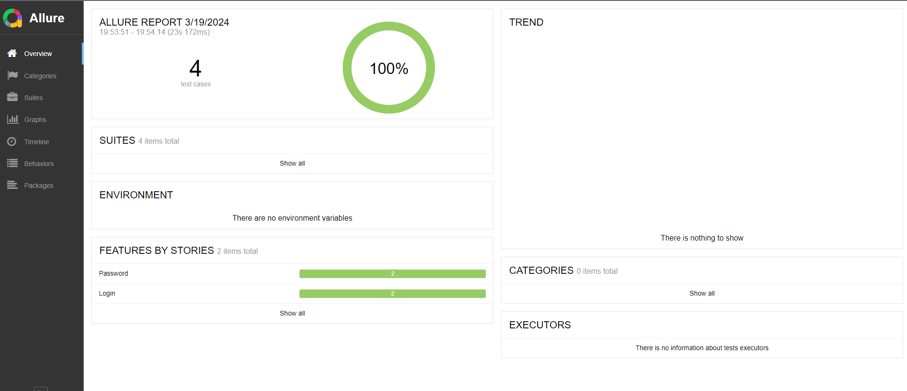

# Challenge QA

Este es un proyecto de pruebas automatizadas de la pagina web https://www.saucedemo.com/, los cuales se encuantran desarrollados por Claudio Rodolfo Garcete, principalmente con python, selenium, behave y allure. Los test se ejecutan de forma local.

## Comenzando

Estas instrucciones te permitirán obtener una copia del proyecto en funcionamiento en tu máquina local para propósitos de desarrollo y pruebas.

### Pre-requisitos

- Es necesario instalar [node.js](https://nodejs.org/en)
- Instalar de forma global [allure-reports](https://www.npmjs.com/package/allure-commandline) : npm install -g allure-commandline --save-dev
- Es necesario tener instalado [python 3.12](https://www.python.org/downloads/) para instalar y ejecutar el proyecto.

### Instalacion

- Clonar el proyecto - `https://github.com/garceteclaudio/web-test-automation.git`.

- Para utilizar el proyecto, se debe abrir una consola bash, situarnos en el directorio raiz del proyecto e instalar las dependencias de la siguiente manera:


```
pip install git+https://github.com/allure-framework/allure-python.git
pip install -r requirements.txt
```


### Ejecutando las pruebas

Las pruebas son ejecutadas localmente.

- Ubicacarse en la raiz del proyecto.

- Ejecutar el siguiente script:

```
behavex --parallel-processes 4 --tags=@servicios
behavex --parallel-processes 4 --tags=@login
```

### Reporte de pruebas

- Ubicarse en la raiz del proyecto, entrar a la carpeta output y abrir el archivo:

```
output/report.html
allure serve

```




## Construido con
* [Python](https://www.python.org/downloads/) - Programming language
* [Selenium WebDriver](https://www.selenium.dev/documentation/webdriver/) - Library for web test automation.
* [Behave](https://behave.readthedocs.io/en/latest/) - Framework para escribir los escenarios de prueba en lenguaje GHERKIN


## Autor
* **Claudio Rodolfo Garcete** - *Automation Tester* 

## Consultas
* garcete.claudio@gmail.com